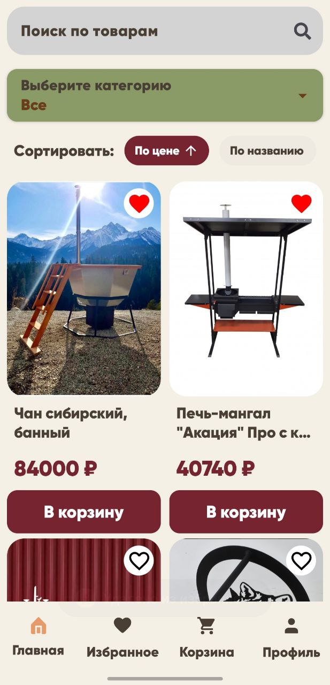
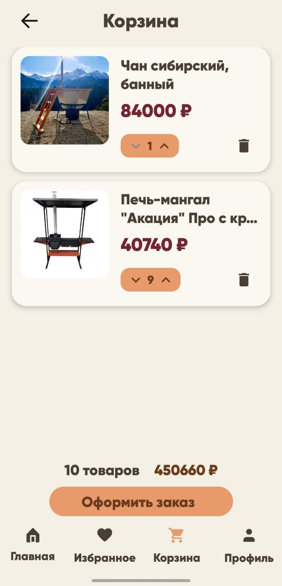
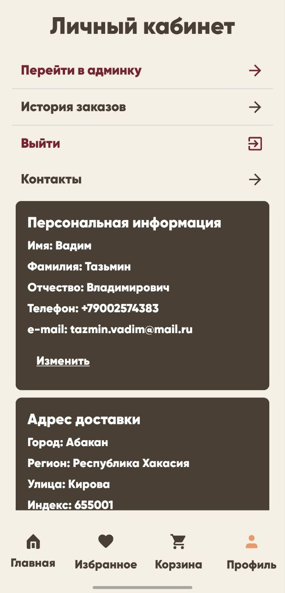

# EcommerceApp

Мобильное приложение для интернет-торговли, разработанное в рамках выпускной квалификационной работы.

## 📱 Функциональность
- Просмотр каталога товаров  
- Добавление в корзину и избранное  
- Регистрация и вход (в том числе анонимный)  
- Работа с Firebase Firestore  

## 🧰 Технологии
- ****, **Coroutines**
- **MVVM**, **Clean Architecture**
- **Firebase Authentication**, **Firestore**
- **Flow**, **ViewModel**
- **Figma** — разработка дизайна
- **DI Hilt**

## 📸 Скриншоты
| Главный экран | Корзина | Профиль |
|----------------|----------|----------|
|  |  |  |

## 📦 APK
Скачать: [AbakanMangal.apk](apk/AbakanMangal.apk)

## 🎓 О проекте
Приложение разработано как часть выпускной квалификационной работы.  
Цель — создание удобного мобильного решения для онлайн-торговли с использованием современных инструментов Android-разработки.

---
## 🎥 Видео-демонстрация
[Посмотреть демо](Video/MangalPreview.mp4)
▶️[Яндекс.Диск](https://disk.yandex.ru/i/Tb8zJ-b3aG7K4w)

© 2025 Вадим Тазмин
